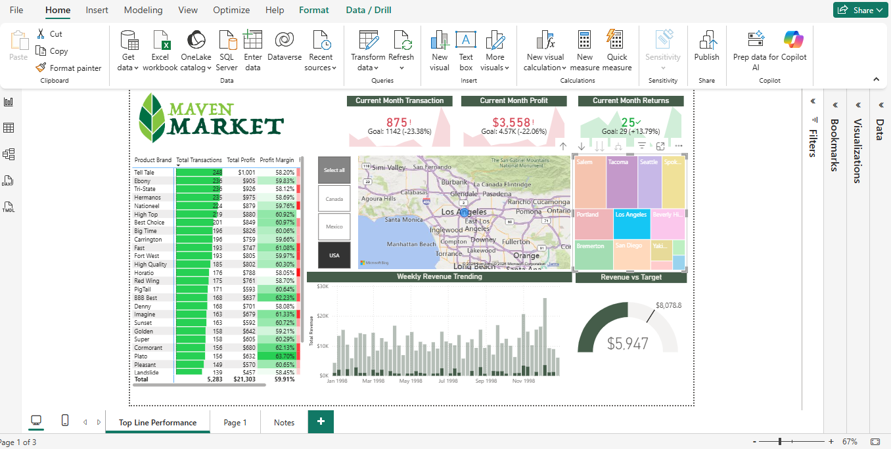
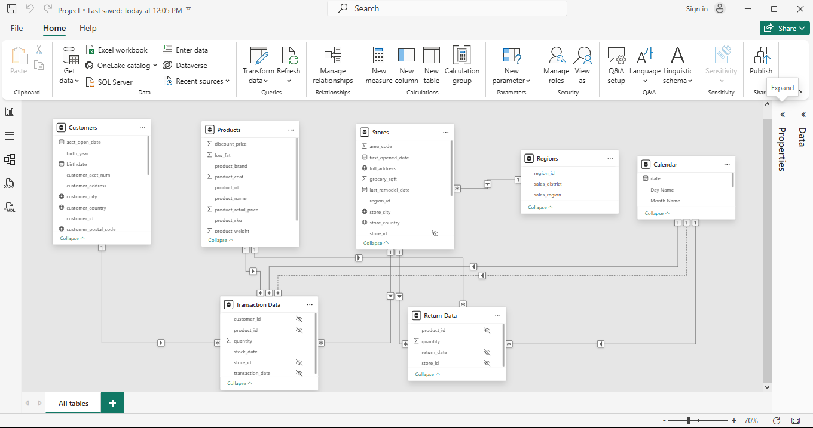
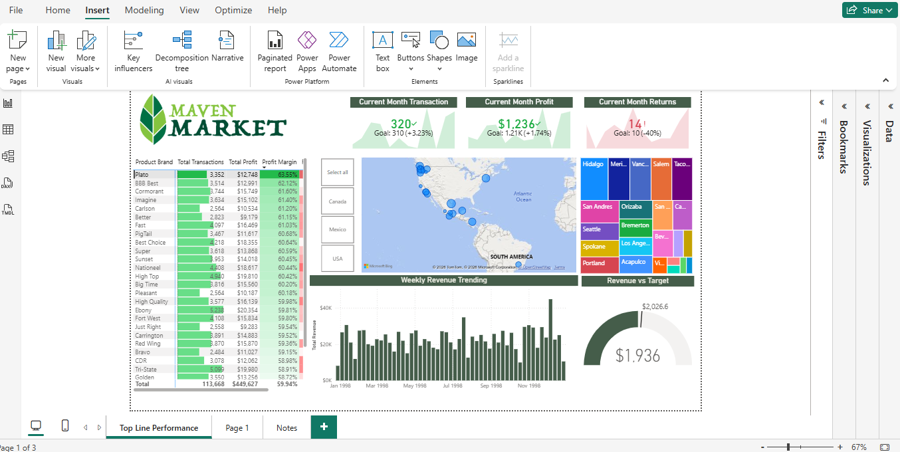
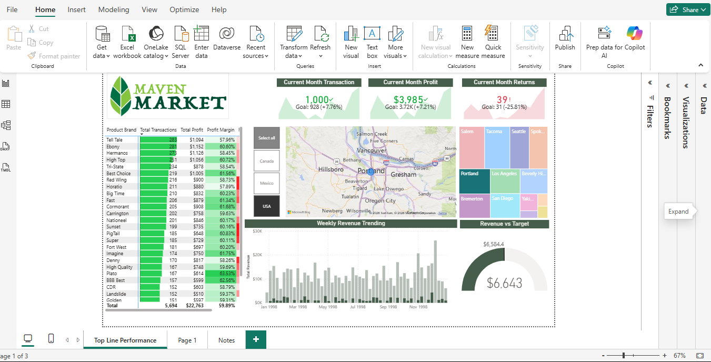

# Power-BI-Sales-Performance-Dashboard
## Overview

This project presents an interactive Power BI dashboard developed to analyze sales performance across multiple countries, cities, and product brands. The dashboard transforms raw sales data into actionable business insights through interactive visualizations, KPIs, bookmarks, and drill-through functionality.

The goal is to help business stakeholders monitor performance, identify high-performing products and regions, and support data-driven decision-making.

## Business Objectives

- Monitor overall sales performance
- Track sales across countries and cities
- Compare product brand performance
- Identify high-performing markets
- Analyze transaction trends
- Provide an interactive reporting experience for decision-makers

## Tools & Technologies

- Power BI Desktop
- Power Query
- DAX
- Microsoft Excel (Data Source)

## Dashboard Features

- Interactive slicers
- KPI cards
- Dynamic visualizations
- Bookmarks
- Navigation buttons
- Drill-through pages
- Maps and treemaps
- Custom insight pages
- DAX measures
## Key Insights

- Tell Tale recorded the highest number of total transactions in Los Angeles, USA.
- Plato products drove the strongest overall profit margin (63.55%) in 1998

# Dashboard Preview

## Sales Analysis

## Data Model

## Product Performance

## Geographical Analysis

## Insights

